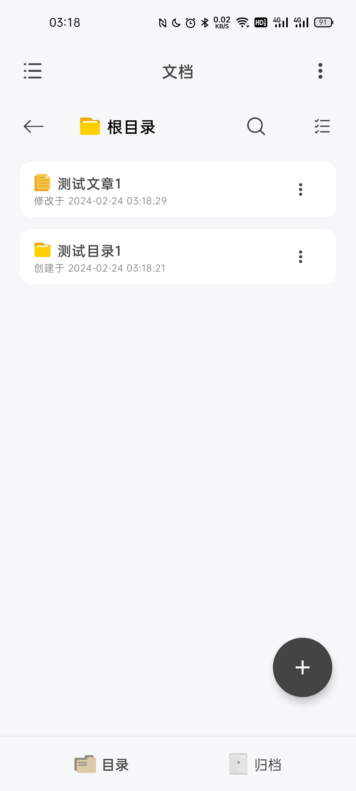
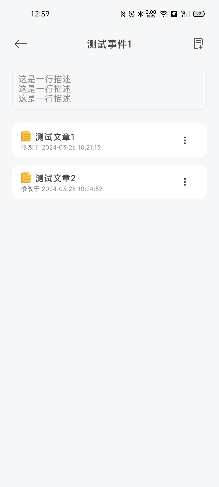

# Easy Note

🌐 View [English Document](./README_EN.md)

本应用是一个简单的本地富文本编辑软件。

**目前支持的富文本编辑功能**：

- [x] 文字加粗/倾斜
- [x] 文字下划线/删除线
- [x] 设置标题文字
- [x] 左对齐/右对齐/居中对齐
- [x] 撤销/重做
- [x] 插入图片
- [x] 插入视频
- [x] 插入音频

**后续准备加入的编辑功能**：

- [ ] 无序列表
- [ ] 有序列表
- [ ] 上标/下标

**后续准备加入/完善的其他功能**：

- [ ] 本地备份/文件导出
- [ ] 编辑器外观部分定制
- [x] 回收站
- [x] 简易归档
- [x] 手动编辑关键词
- [x] 文章关键词提取（实验性功能，By [HanLP](https://github.com/hankcs/HanLP)）

## 快照 Snapshot

|                             首页                             |                            事件页                            | **编辑页**                                                |
| :----------------------------------------------------------: | :----------------------------------------------------------: | --------------------------------------------------------- |
|  |  |  |

|                         事件详情页                         |                           关键词页                           |
| :--------------------------------------------------------: | :----------------------------------------------------------: |
|  |  |

## 下载 Download

[Click here](https://github.com/PolyOxyethylene/EasyNote/releases/latest)