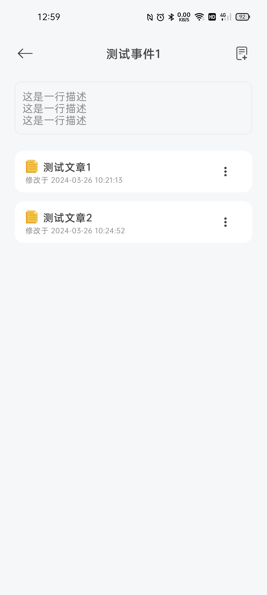
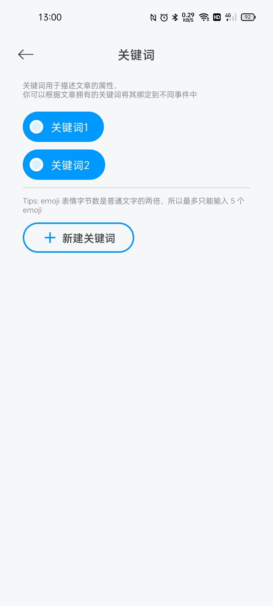

# Easy Note

🌐 View [简体中文文档](./README.md)

This application is a simple local rich text editing software.

**Currently supported rich text editing features**:

- [x] Bold/italic text
- [x] Underline/strikethrough text
- [x] Set title text
- [x] Left alignment/right alignment/centered alignment

- [x] Undo/redo

- [x] Insert images

- [x] Insert videos

- [x] Insert audio

**Features to be added in the future**:

- [ ] Bulleted lists

- [ ] Numbered lists

- [ ] Superscript/subscript

**Other features to be added or improved in the future**:

- [ ] Local backup/file export
- [ ] Partial customization of editor appearance
- [x] recycle bin
- [x] Simple archiving
- [x] Manual editing of keywords
- [x] Article keyword extraction (experimental feature，By [HanLP](https://github.com/hankcs/HanLP))

## Snapshot

|                        **Home Page**                         |                       **Archive Page**                       |                       **Edit Page**                       |
| :----------------------------------------------------------: | :----------------------------------------------------------: | :-------------------------------------------------------: |
|  |  |  |

|                        Archive Info                        |                         Keyword Page                         |
| :--------------------------------------------------------: | :----------------------------------------------------------: |
|  |  |

## Download the latest release

[Click here](https://github.com/PolyOxyethylene/EasyNote/releases/latest)

