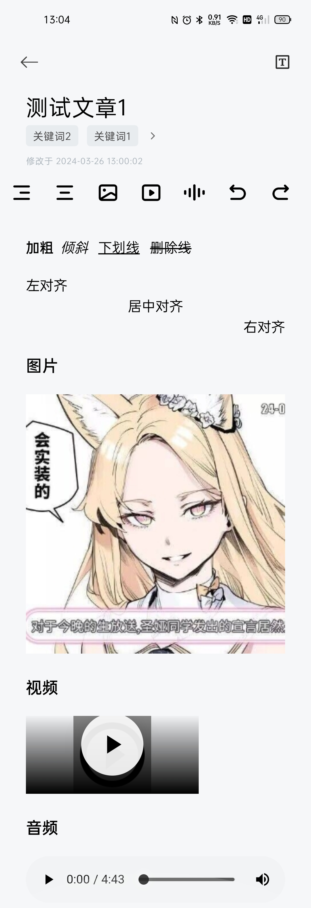

  

<h1 align="center">Easy Note</h1> 

🌐 View [简体中文文档](./README.md) | [繁體中文檔案](./README_TC.md)

This application is a simple local rich text editing software.

**Currently supported rich text editing features**:

- [x] Bold/italic text
- [x] Underline/strikethrough text
- [x] Set title text
- [x] Left alignment/right alignment/centered alignment
- [x] Undo/redo
- [x] Insert images
- [x] Insert videos
- [x] Insert audio
- [x] Bulleted lists
- [x] Numbered lists

**Features to be added in the future**:

- [ ] Superscript/subscript

**Other features to be added or improved in the future**:

- [ ] Local backup/file export
- [ ] Partial customization of editor appearance
- [x] Brief record of article revisions(including the information of revision time and location)
- [x] Recycle bin
- [x] Simple archiving
- [x] Manual editing of keywords
- [x] Article keyword extraction(experimental feature，By [HanLP](https://github.com/hankcs/HanLP) and [chatanywhere](https://github.com/chatanywhere/GPT_API_free))

## Snapshot

|                        **Home Page**                         |                       **Archive Page**                       |                       **Edit Page**                       |
| :----------------------------------------------------------: | :----------------------------------------------------------: | :-------------------------------------------------------: |
|  |  |  |

|                        Archive Info                        |                         Keyword Page                         |
| :--------------------------------------------------------: | :----------------------------------------------------------: |
|  |  |

## Download the latest release

[Click here](https://github.com/PolyOxyethylene/EasyNote/releases/latest)

