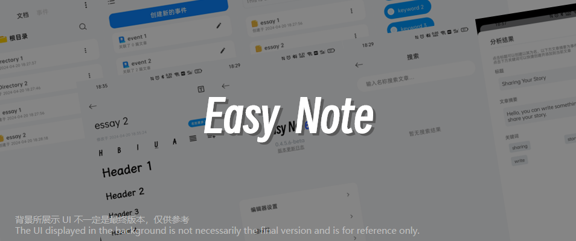
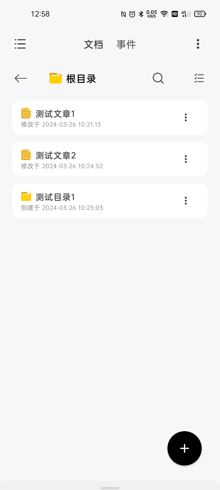
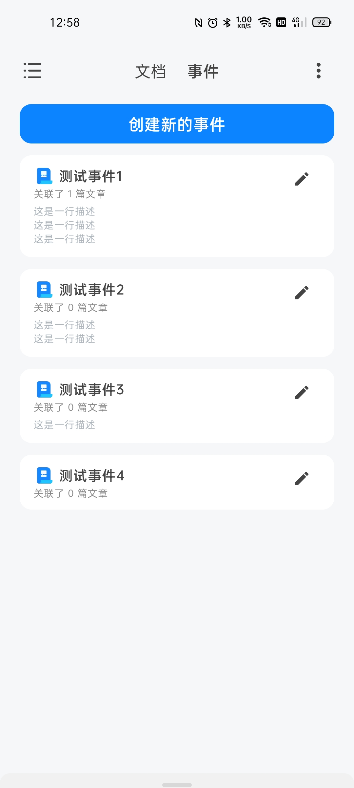

  

<h1 align="center">Easy Note</h1> 

🌐 View [简体中文文档](./README.md) | [English Document](./README_EN.md)

本應用是一個簡單的本地富文本編輯軟體。

**目前支援的富文本編輯功能**：

- [x] 文字加粗/彎曲
- [x] 文字下劃線/刪除線
- [x] 設置標題文字
- [x] 左對齊/右對齊/居中對齊
- [x] 撤銷/重做
- [x] 插入圖片
- [x] 插入影片
- [x] 插入音訊
- [x] 無序列表
- [x] 有序列表

**後續準備加入的編輯功能**：

- [ ] 上標/下標

**後續準備加入/完善的其他功能**：

- [ ] 本地備份/檔案匯出
- [ ] 編輯器外觀部分定制
- [x] 文章修改的簡單記錄(包括修改時間和地點資訊)
- [x] 回收站
- [x] 簡易檔案管理
- [x] 手動編輯關鍵詞
- [x] 文章關鍵詞提取(實驗性功能，By [HanLP](https://github.com/hankcs/HanLP) and [chatanywhere](https://github.com/chatanywhere/GPT_API_free))

## 快照 Snapshot

|                             首頁                             |                            事件页                            |                          編輯頁                           |
| :----------------------------------------------------------: | :----------------------------------------------------------: | :-------------------------------------------------------: |
|  |  |  |

|                         事件詳情頁                         |                           關鍵字頁                           |
| :--------------------------------------------------------: | :----------------------------------------------------------: |
|  |  |

## 下载 Download

[Click here](https://github.com/PolyOxyethylene/EasyNote/releases/latest)